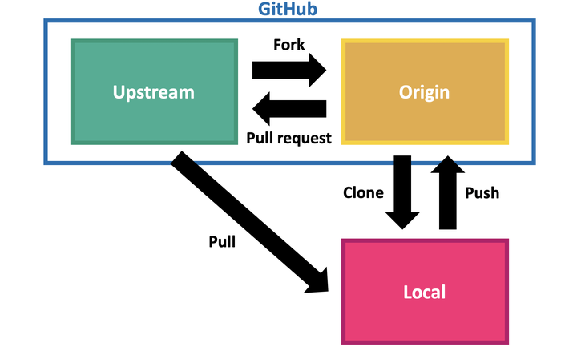

# CS 스터디 레포지토리 운영 가이드

## 작업 흐름

1. 메인 레포지토리를 **Fork** (내 계정으로 복사, 최초 1회만)
2. 내 레포지토리를 **Clone** (내 PC로 다운로드, 최초 1회만)
3. 새로운 작업 브랜치 생성
   ```bash
   git checkout -b topic/이름
   ```
4. 파일 수정 후 **Commit** (변경사항 저장)
5. **Push** (내 GitHub 레포에 업로드)
6. **Pull Request** (메인 레포지토리에 반영 요청)
7. Pull Request 검토 후 충돌 없으면 승인 및 Merge
8. 작업한 브랜치 삭제 후, 메인 레포 최신화

---

## SourceTree 설치

- [SourceTree 다운로드](https://www.sourcetreeapp.com/)
- Bitbucket 계정 필요
- Git 변경 내역을 GUI로 확인할 수 있는 도구
- 설치 시 git / git bash 함께 설치됨

---

## 원본 레포지토리 추가 (Upstream 설정)

최신 변경사항을 받아오기 위해 원본 레포지토리를 remote로 추가합니다.

1. SourceTree에서 **Settings** (톱니바퀴) 클릭
2. **Remotes** 탭 선택 → **Add** 클릭
3. 정보 입력:
   - **Remote name**: `upstream`
   - **URL/Path**: `https://github.com/aaxx98/cs-study`



- origin은 복사된 내 계정의 repo입니다.
- upstream은 스터디 repo입니다.

  **remote 이름은 자유롭게 설정하셔도 됩니다.**

### CLI

```
git remote add upstream https://github.com/aaxx98/cs-study.git
 git remote -v
```

---

## 파일 수정하기

1. Clone된 폴더에서 원하는 파일 수정
2. 마크다운 파일(`.md`)을 텍스트 에디터로 편집
   - 예: `운영체제/README.md`에 정리 내용 작성

### 파일 변경 전 최신 변경사항 가져오기

- 반드시 원본 fetch
- 현재 브랜치와 원본(upstream) 브랜치를 merge

### CLI

```
git fetch upstream
git merge upstream/main
```

---

## Commit

변경 사항을 커밋합니다.

### Commit 규칙

- 변경 내용과 연결된 이슈 번호를 작성합니다.  
  예시:
  ```
  #1 운영체제: 프로세스와 스레드 정리
  ```

### CLI

```
# 변경사항 전체 스테이징에 올리기
git add .

# 특정 파일 스테이징에 올리기
git add [파일명]

git commit -m ' #1 운영체제: 프로세스와 스레드 정리'
```

---

## Push

변경 사항을 fork한 레포지토리에 반영합니다.

### CLI

```
git push origin main
```

## Pull Request

변경 사항을 pull하면, [스터디 레포지토리](https://github.com/aaxx98/cs-study)에 Pull Request 버튼이 보입니다.

### Pull Request 규칙

- PR 제목 형식: `[주제명] 내용 요약 (#이슈번호)`
- 예시:
  ```
  [운영체제] 프로세스와 스레드 정리 (#1)
  ```

---

## 브랜치 전략

선택 사항입니다.

- `main`: 최종 정리된 문서만 반영 (보호 브랜치)
- `topic/이름`: 개인 작업 브랜치 ex) 브랜치 이름: os/aaxx98

---

## 전체 흐름 요약

Fork → Clone → Branch 생성 → Commit → Push → Pull Request → Merge → 브랜치 삭제 → Upstream fetch

---

## VSCode에서 Fork 저장소 원본 동기화하기

### 1. 현재 원격 저장소 확인
```bash
git remote -v
```

```bash
origin  https://github.com/ms-0o0/cs-study.git (fetch)
origin  https://github.com/ms-0o0/cs-study.git (push)
```
위처럼 나오면 잘 연결된 것!

### 2. (선택) 원격 저장소 이름 변경
현재 원격 저장소 이름을 바꾸고 싶다면 아래 명령어 실행:

```bash
git remote rename origin <변경하고자 하는 이름>
```
예시: 원본 저장소를 origin으로 쓰고 싶어서 fork 이름을 mskim으로 변경 ```remote rename origin mskim```

### 3. 원본 저장소 주소 추가
```bash
git remote add <원격 저장소 이름> https://github.com/aaxx98/cs-study.git
```

정상적으로 추가되면:
```bash
코드 복사
mskim   https://github.com/<내 깃 주소>/cs-study.git (fetch)
mskim   https://github.com/<내 깃 주소>/cs-study.git (push)
origin  https://github.com/aaxx98/cs-study.git (fetch)
origin  https://github.com/aaxx98/cs-study.git (push)
```

### 4. 원본 저장소 변경 사항 확인
```bash
git fetch origin
```
변경 사항이 있으면 로그가 길게 출력됨

터미널이 : 상태로 멈추면 q + Enter로 빠져나오기

### 5. 원본 저장소 변경 사항 병합
``` bash
git merge <원본 저장소>/main
```

### 6. 내 저장소에 푸시
```bash
git push <네 저장소> main
```